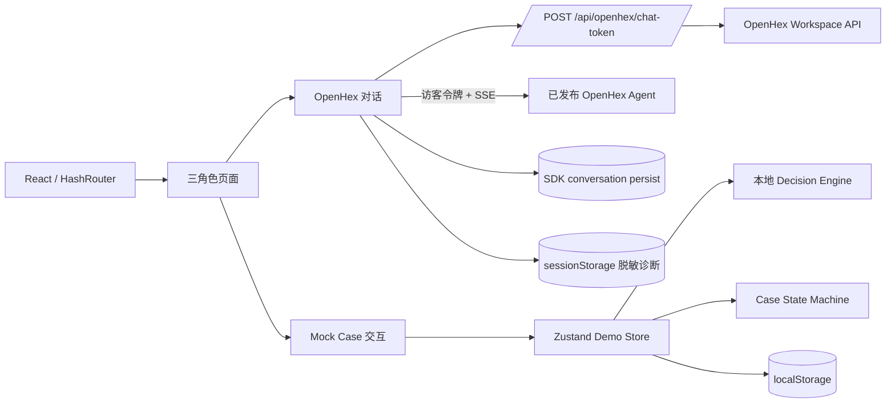

# 系统架构

## 总览

## 前端层次

- `app/`：路由和角色同步。
- `pages/`：页面编排，不直接实现业务判断。
- `components/conversation/`：真实 Agent 与 Mock 对话展示。
- `components/cases/`：Case 通用显示。
- `components/layout/`：应用框架、角色切换和演示工具栏。
- `domain/`：无 UI 的数据类型、状态迁移和本地决策规则。
- `store/`：持久化 Mock 业务状态和非持久化 UI 状态。
- `services/`：外部边界，包括令牌、语音和诊断。

## 两条数据流

### OpenHex

```mermaid
sequenceDiagram
  participant U as 老人
  participant B as 浏览器
  participant V as Vercel Function
  participant O as OpenHex
  U->>B: 输入或语音草稿
  B->>V: POST /api/openhex/chat-token
  V->>O: startVisitorSession
  O-->>V: 30 分钟访客令牌
  V-->>B: token + expiresAt
  B->>O: POST conversation/send
  B->>O: SSE conversation/stream
  O-->>B: 事件与流式文本
  B-->>U: 实时回复
```

### Mock Case

`mockDecisionEngine` 解析老人或家属输入并返回决策；`demoStore` 根据决策创建或更新 Case；状态迁移由 `caseStateMachine` 验证；所有角色从同一个 store 读取，因此能看到同步进度。此链路不访问网络。

## 状态与所有权

| 状态 | 所有者 | 持久化 |
| --- | --- | --- |
| OpenHex messages / conversationId | SDK hook | SDK localStorage namespace |
| Mock cases / role / local messages | `demoStore` | `anxu-eldercare-demo-state` |
| OpenHex / Phase 4 模式 | `demoUiStore` | 否，刷新后按 Agent 配置恢复默认 |
| 最近诊断事件 | `openhexDiagnostics` | 当前标签页 sessionStorage |
| 稳定访客身份 | Vercel Function | HttpOnly `ohx_ref` Cookie |
| 短时令牌缓存 | `openhexToken` 模块 | 内存，过期前 60 秒刷新 |

全局重置由 `demoReset` 协调：清空共享业务 Store、UI 模式、SDK 对话和历史缓存、令牌缓存、诊断与预留的传感器状态，并通过同源 `POST /api/openhex/demo-reset` 使 HttpOnly 访客 Cookie 过期。静态预览中该接口不可用时，本地对话仍会清空并从新会话开始。

## 视觉架构

`src/styles.css` 保留原有组件结构规则；`src/styles/tokens.css` 定义颜色、字体、间距、圆角和层级；`src/styles/redesign.css` 负责新版页面布局、角色层次、响应式和交互状态。新样式不得绕过设计令牌新增随机颜色或阴影。
