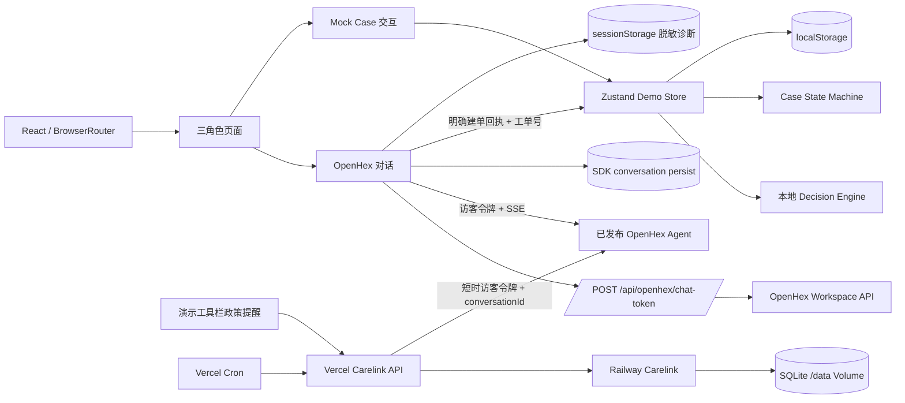
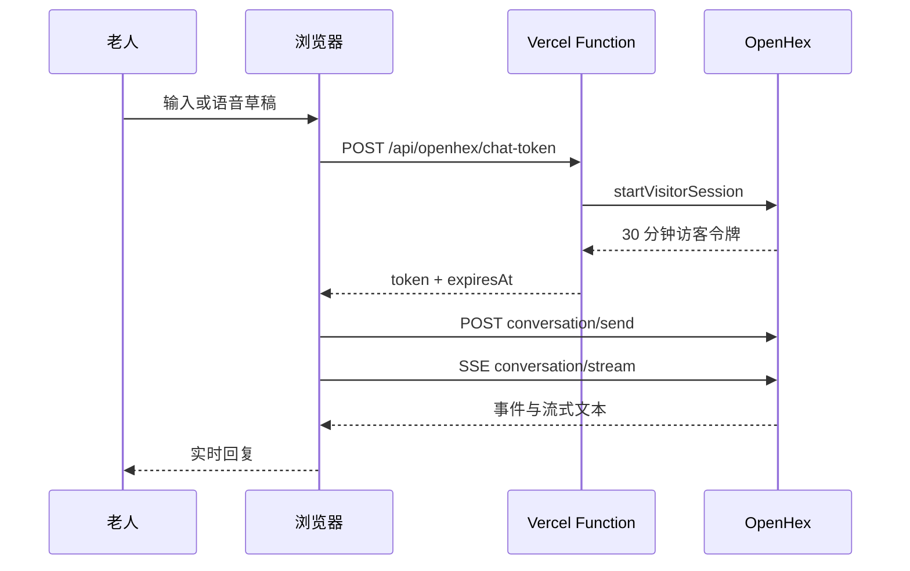

# 系统架构

## 总览

## 部署与路由

- Vercel 托管 Vite 静态产物和 `api/` 下的 Serverless Functions；`vercel.json` 将 `/elder`、`/family`、`/staff` 及其子路径重写到 `index.html`，由 `BrowserRouter` 继续解析。
- 本地真实联调使用 `vercel dev`，因为单独运行 Vite 不会提供令牌和 Carelink 接口；`file://` 无法运行当前路由与服务端能力。
- Railway 从 GitHub `main` 自动部署 Carelink。仓库根目录 `railway.toml` 指向 `Dockerfile.carelink`，只复制 `services/carelink/`；`/data` Volume 保存 SQLite。
- 浏览器直接连接 OpenHex SSE，Vercel 不代理长连接；后台政策触发由 Vercel Function 使用服务端凭据连接同一会话。

## 前端层次

- `app/`：路由和角色同步。
- `pages/`：页面编排，不直接实现业务判断。
- `components/conversation/`：真实 Agent 与 Mock 对话展示。
- `components/cases/`：Case 通用显示。
- `components/layout/`：应用框架、角色切换和演示工具栏。
- `domain/`：无 UI 的数据类型、状态迁移和本地决策规则。
- `store/`：持久化 Mock 业务状态和非持久化 UI 状态。
- `services/`：外部边界，包括令牌、语音、诊断、历史对账、Carelink 浏览器 API 和 OpenHex 工单镜像。
- `services/carelink/`：独立 Python 服务，负责官方政策抓取核验、订阅、批次租约和去重。
- `api/carelink/`、`api/cron/`：Vercel 同源入口与定时编排，负责安全访问 Railway 和 OpenHex。

## 主要数据流

### OpenHex

### Mock Case

`mockDecisionEngine` 解析老人或家属输入并返回决策；`demoStore` 根据决策创建或更新 Case；状态迁移由 `caseStateMachine` 验证；所有角色从同一个 store 读取，因此能看到同步进度。此链路不访问网络。

### Carelink 政策提醒

浏览器把当前 OpenHex 会话绑定到固定演示档案；Railway 持久化稳定访客引用和会话 ID。Cron 先核验政策，再租赁待推送批次；Vercel 用该访客引用签发短时令牌，查询会话历史标记后发送内部触发消息。前端隐藏触发消息，通过定期、页面聚焦、可见性恢复与手动推送后的快速轮询同步 Agent 回复。详见 [Carelink 接入](./carelink-integration.md)。

### OpenHex 外部工单镜像

`openhexCaseBridge` 只处理已完成的 Agent 回复：文本必须明确表示建单成功，并包含符合 `CASE-YYYYMMDD-NNN` 的工单号。若历史中存在建单工具参数，会优先用于补全服务类型、医院、时间和摘要；信息不足时创建待人工评估 Case。

`demoStore.importOpenhexCase` 以外部工单号作为幂等键：首次创建 `caseSource: 'OPENHEX'` 的本地 Case，后续只补全同一 Case，不覆盖非 OpenHex Case。三角色页面仍从同一浏览器的 `demoStore` 读取。此流程不运行本地意图引擎、不调用飞书、不回写 OpenHex，也不提供跨设备同步。

## 服务端接口边界

| 接口 | 调用方 | 职责 |
| --- | --- | --- |
| `POST /api/openhex/chat-token` | 浏览器 | 使用稳定访客引用签发 30 分钟令牌 |
| `POST /api/openhex/demo-reset` | 浏览器 | 清理当前演示访客、解除政策订阅并使 Cookie 过期 |
| `GET /api/carelink/status` | 浏览器 | 返回脱敏的政策订阅状态 |
| `POST/DELETE /api/carelink/subscribe` | 浏览器 | 绑定或解除当前 OpenHex 会话 |
| `POST /api/carelink/manual-push` | 浏览器 | 触发带冷却限制的政策刷新与推送 |
| `GET /api/cron/carelink-crawl` | Vercel Cron | 更新并核验政策缓存 |
| `GET /api/cron/carelink-push` | Vercel Cron | 领取批次并触发绑定会话中的 Agent |

## 状态与所有权

| 状态 | 所有者 | 持久化 |
| --- | --- | --- |
| OpenHex messages / conversationId | SDK hook | SDK localStorage namespace |
| Mock cases / role / local messages | `demoStore` | `anxu-eldercare-demo-state` |
| OpenHex / Phase 4 模式 | `demoUiStore` | 否，刷新后按 Agent 配置恢复默认 |
| 最近诊断事件 | `openhexDiagnostics` | 当前标签页 sessionStorage |
| 稳定访客身份 | Vercel Function | HttpOnly `ohx_ref` Cookie |
| 短时令牌缓存 | `openhexToken` 模块 | 内存，过期前 60 秒刷新 |
| 当前会话 ID | `demoUiStore` | 内存，仅供订阅按钮绑定 |
| 政策、订阅、批次、去重历史 | Railway Carelink | `/data/policies.sqlite3` Volume |

全局重置由 `demoReset` 协调：清空共享业务 Store、UI 模式、SDK 对话和历史缓存、令牌缓存、诊断与预留的传感器状态，并通过同源 `POST /api/openhex/demo-reset` 解除 Carelink 订阅、清除王阿姨的演示推送记录并使 HttpOnly 访客 Cookie 过期。政策缓存和抓取日志保留。静态预览中接口不可用时，本地对话仍会清空并从新会话开始。

## 视觉架构

`src/styles.css` 保留原有组件结构规则；`src/styles/tokens.css` 定义颜色、字体、间距、圆角和层级；`src/styles/redesign.css` 负责新版页面布局、角色层次、响应式和交互状态。新样式不得绕过设计令牌新增随机颜色或阴影。
