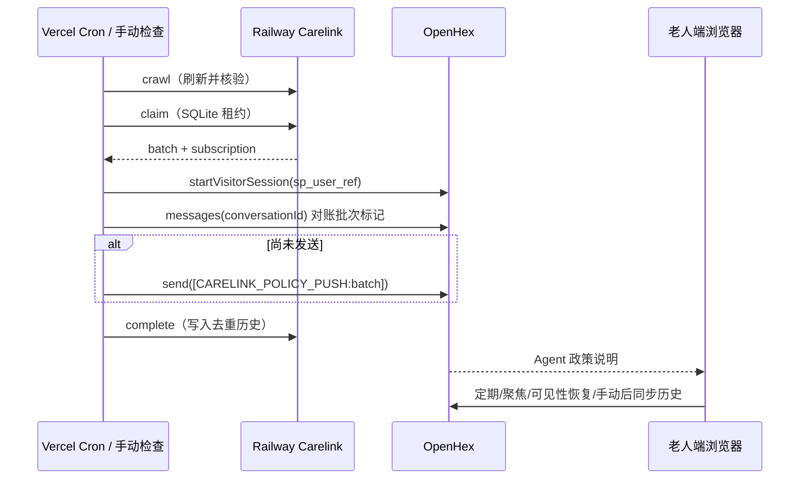

# Carelink 政策提醒接入

## 业务范围

固定演示对象为 `E001 / 王阿姨 / 82 岁 / 天津市户籍`。用户必须先在老人端创建 OpenHex 对话，再在演示工具栏启用每日提醒；每次只保留一个绑定会话，重新绑定会替换旧会话。

Carelink 政策提醒属于真实 OpenHex 对话，不创建或修改本地 Mock Case。政策来源在 Agent 回复中以 `[政策标题](https://政府原文)` 展示，浏览器只把 `https:` Markdown 标题链接渲染为新标签页链接。

## 调度与数据流

Vercel Cron 使用 UTC：`0 0 * * *` 对应北京时间 08:00–08:59 抓取，`0 1 * * *` 对应 09:00–09:59 推送。Hobby 调度可能在该小时内浮动，不承诺分钟级准时。

## 幂等与失败语义

- `deliveryId` 标识政策版本及提醒次数；批次 ID 由接收人和 delivery IDs 稳定计算。
- `claim` 使用 10 分钟租约和 SQLite 写锁；并发任务只能有一个得到批次。
- Vercel 发送前查询 OpenHex 历史中的 `[CARELINK_POLICY_PUSH:<batchId>]`。存在时不重发，直接补做完成确认。
- 只有 OpenHex `chat.send` 返回接受结果后才 `complete`。任一步失败调用 `fail`，不写入 `sent`，后续任务可重试。
- 手动检查有 60 秒冷却；全局重置解除订阅并清除该演示用户的 proposals、sent 和批次，不删除政策与抓取日志。

## 密钥与隐私

| 位置 | 变量 |
| --- | --- |
| Railway | `POLICY_API_KEY`、`POLICY_DB_PATH=/data/policies.sqlite3`、平台注入的 `PORT` |
| Vercel Server | `CARELINK_API_BASE_URL`、`CARELINK_API_KEY`、`CRON_SECRET`、`OPENHEX_AGENT_ID`、既有 OpenHex 工作区变量 |
| 浏览器 | 只有非敏感订阅状态、Agent ID 和短时访客令牌 |

`CARELINK_API_KEY`、`CRON_SECRET`、工作区密钥、完整访客标识和内部批次内容不得进入浏览器日志、诊断或公开响应。Railway API 的异常统一映射为通用错误。

## Railway 运维

1. GitHub 仓库连接为当前项目，Root Directory 为 `/services/carelink`。
2. 挂载 `/data` Volume，公开 HTTPS 域名，健康检查 `/health`。
3. 设置 Railway 变量，并将域名和相同 API Key 配置到 Vercel。
4. 先验证 `/health`，再人工触发 crawl、绑定会话和 manual-push。

上游来源与同步方式见 `services/carelink/UPSTREAM.md`，服务内接口见 `services/carelink/openapi.json`。
