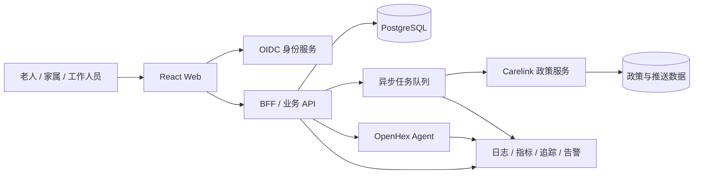

# 从比赛 Demo 到线上应用的成熟度评估

## 评估基线

| 项目 | 基线 |
| --- | --- |
| 评估日期 | 2026-09-21 |
| 代码基线 | GitHub `main` 提交 [`1eaadae`](https://github.com/McdonaldsQueen/anxu-eldercare-demo/tree/1eaadae498278524f351acbd6a4ea2a223b3e4dd) |
| 自动化验证 | 118 项前端测试、11 项 Carelink Python 测试 |
| 部署快照 | Vercel Production Ready；Railway Carelink 健康检查正常；两个每日 Cron 已注册 |
| 评估范围 | 仓库代码、测试、CI、Vercel/Railway 拓扑、数据边界与公开配置 |

本报告是基于上述时间点的工程成熟度判断，不是实时监控面板、渗透测试、法律意见、真实用户研究或容量测试结论。提交号、测试数量和部署状态变化后，应先更新本节，再复核后续评分。

## 结论

当前项目已经具备完整的比赛展示和内部验证能力，但还不适合直接开放给真实老人、家属或养老机构使用。

OpenHex 流式对话、政策核验、工单镜像、三角色 Case 流程和自动化测试已经形成可复用的产品基础。阻碍上线的主要问题不在页面数量，而在真实身份、机构权限、共享业务数据库、人工风险闭环、集中审计、告警和个人信息权利链路。

推荐采用“保留体验层、替换业务底座”的方式推进，并先以单机构、邀请制、有限用户和人工兜底的受控试点为目标。在完成本报告列出的 P0 发布门槛前，不应把产品宣传为实时急救、医疗诊断或无人值守照护服务。

## 可保留的产品化基础

- OpenHex 工作区密钥仅存在于服务端，浏览器使用短时访客令牌。
- Agent 回复使用 SSE 流式展示，并具备空闲超时分类、重连和历史对账能力。
- OpenHex 明确确认建单成功且包含有效外部工单号时，可以幂等镜像到当前浏览器的 Case Store。
- Carelink 对政策来源进行核验，并通过租约、批次标记和确认流程控制重复推送。
- Mock Case 与真实 Agent 数据边界已有 ADR 约束，安全事件最终分类保留人工审核。
- 前端、Vercel Functions、Railway Python 服务和两个每日任务已经形成可运行的部署拓扑。
- 当前基线下前端测试、Python 测试和生产构建均可通过。

这些能力可以继续演进，不需要推倒重来。但当前浏览器 Store、固定演示身份和单机 SQLite 不能继续承担正式业务系统职责。

## 当前成熟度

评分采用 0–5 分制：`0` 表示缺失，`1` 表示仅适合 Demo，`2` 表示具备部分试点能力但仍依赖重大人工控制，`3` 表示达到受控试点门槛，`4` 表示满足目标规模生产要求，`5` 表示已经过规模化、恢复和合规验证。

评分是基于代码和部署证据的方向性工程判断，不是用户使用数据。

| 能力域 | 当前评分 | 受控试点门槛 | 证据与主要缺口 |
| --- | ---: | ---: | --- |
| 隐私与合规 | 0.5 | 3 | 尚未形成告知同意、敏感信息单独同意、保留期限、访问删除导出、影响评估和审计闭环 |
| 身份与角色权限 | 1.0 | 3 | 使用固定演示身份，角色可在前端切换，没有真实认证和机构级 RBAC |
| 共享业务数据与多租户 | 1.0 | 3 | Case、关系和员工操作主要保存在 `localStorage`，不支持跨设备一致性和租户隔离 |
| 可观测性与值班响应 | 1.0 | 3 | 诊断主要在 `sessionStorage`，没有集中日志、指标、追踪、告警和 on-call |
| 交付治理 | 1.0 | 3 | `main` 未发现可见分支保护，CI 尚未覆盖 Python、E2E 和持续安全扫描 |
| 可靠性与灾备 | 1.5 | 3 | 已有幂等、租约和健康检查，缺少正式备份、恢复演练、RPO/RTO 和容量验证 |
| 部署与扩展能力 | 2.0 | 3 | Vercel 与 Railway 已运行，但固定用户、单 SQLite 和缺少队列限制规模化 |
| 适老体验与无障碍 | 2.0 | 3 | 已有响应式、键盘和大点击区域设计，缺少真实老人研究、自动无障碍检查和端到端验证 |
| AI 安全与失败恢复 | 2.5 | 3 | 已有超时恢复、历史对账和人工审核边界，缺少线上质量监控、服务端动作授权和升级 SLA |
| 核心体验与测试自动化 | 3.0 | 3 | 已具备真实对话、政策提醒、Case 流程和较完整单元测试，仍缺真实 E2E 与负载测试 |

## 三个结构性缺口

### 浏览器状态不是业务系统

老人、家属、员工、亲属关系和 Case 主要存在于当前浏览器。OpenHex 工单镜像也只在当前浏览器持久化。这无法可靠支持跨设备协作、并发更新、真实机构权限、客服处理或完整审计。

### 人工责任尚未成为系统能力

项目已经能够识别和展示风险流程，但没有真实值班队列、事件责任人、升级 SLA、通知送达确认和事故复盘机制。养老风险场景不能依赖用户刷新页面或开发者临时读取浏览器诊断。

### 敏感数据治理必须先于规模增长

产品可能处理年龄、家庭关系、位置、风险事件、健康描述和对话内容。《中华人民共和国个人信息保护法》将医疗健康信息列为敏感个人信息；《网络数据安全管理条例》要求采取与数据规模和类型相适应的加密、备份、访问控制、安全认证和事件处置措施。正式上线前还应结合个人信息保护合规审计和生成式人工智能服务相关要求确认适用范围。

相关官方来源：

- [《中华人民共和国个人信息保护法》](https://www.npc.gov.cn/WZWSREL25wYy9jMi9jMzA4MzQvMjAyMTA4L3QyMDIxMDgyMF8zMTMwODguaHRtbD9yZWY9aW1i)
- [《网络数据安全管理条例》](https://www.cac.gov.cn/2024-09/30/c_1729384452307680.htm)
- [《个人信息保护合规审计管理办法》](https://www.cac.gov.cn/2025-02/14/c_1741233507681519.htm)
- [《生成式人工智能服务管理暂行办法》](https://www.cac.gov.cn/2023-07/13/c_1690898327029107.htm)
- [《人工智能生成合成内容标识办法》](https://www.cac.gov.cn/2025-03/14/c_1743654684782215.htm)

## 受控试点 P0 发布门槛

以下项目是允许真实用户进入系统之前的硬门槛，不是普通体验优化项。

| 顺序 | 发布门槛 | 当前缺口 | 最低验收标准 | 责任角色 |
| ---: | --- | --- | --- | --- |
| 1 | 真实身份与机构 RBAC | 固定 `E001/F001/S001`，角色可在前端切换 | 接入 OIDC；老人、家属、员工和机构关系由服务端授权；敏感角色启用 MFA；所有写操作鉴权 | 后端、安全 |
| 2 | 服务端业务数据层 | Case、关系和员工操作保存在浏览器 | 建立 PostgreSQL 数据模型、迁移、并发控制、幂等写入、审计时间线和跨设备一致性 | 后端、数据 |
| 3 | 隐私与用户权利 | 没有正式告知同意、保留策略和删除导出流程 | 完成数据地图、最小必要、敏感信息单独同意、保留期限、访问更正删除和个人信息保护影响评估 | 产品、法务、安全 |
| 4 | 风险事件人工闭环 | 风险流程主要为 Mock，缺少真实值班责任 | 明确非诊断边界；上线人工确认队列、升级 SLA、失败兜底、事件审计和定期演练 | 运营、安全、产品 |
| 5 | API 与边界安全 | 访客令牌和业务接口没有真实用户身份与业务级限流 | 增加 WAF/限流、CSRF/Origin 强化、CSP/安全头、密钥轮换、最小权限和渗透测试 | 安全、平台 |
| 6 | 集中可观测与告警 | 主要依赖浏览器诊断和人工查看 | 建立结构化日志、指标、追踪、敏感字段脱敏、SLO/错误预算、告警和 on-call runbook | 平台、运营 |
| 7 | 备份与恢复 | Railway Volume 尚无正式备份和恢复证据 | 实施加密备份、恢复演练、RPO/RTO、第三方中断预案和定期恢复验证 | 平台、数据 |
| 8 | 受控发布治理 | `main` 无可见保护，CI 主要覆盖 Node 测试与构建 | 启用必需 PR 审查、受保护主分支、Python/E2E/SAST/依赖扫描、Preview 验收、功能开关和回滚演练 | 工程负责人 |

## 目标生产架构

目标架构应遵循以下边界：

- Case、用户关系、机构、权限、风险事件、状态迁移和审计日志进入服务端；浏览器只保留短期界面状态。
- OpenHex 继续负责自然语言交互，但任何产生业务影响的动作必须经过服务端授权、幂等键、参数校验和审计记录。
- Agent 对高风险事件只能提出建议，不直接完成风险闭环；服务端创建待确认事件，由值班人员确认、升级并记录响应时间。
- Carelink 短期可以继续使用 Python 和 Railway，但订阅主体应从固定演示用户迁移到真实用户与机构模型。
- SQLite 可以服务早期受控试点；进入多机构或公开 Beta 前，应迁移到托管 PostgreSQL，或由统一业务后台持有订阅与推送状态。

## 分阶段路线图

### 阶段 A：定义上线边界

确认首个机构、目标用户数量、服务地域、是否涉及医疗建议、人工服务时段、事故责任和第三方数据处理区域；完成数据地图和个人信息保护影响评估。

### 阶段 B：建立可信底座

上线真实身份与 RBAC、服务端 Case 和关系模型、审计日志、最小权限、速率限制、CSP、安全头、密钥轮换、备份恢复和集中监控；补齐 Python CI、E2E、安全扫描和主分支保护。

### 阶段 C：邀请制受控试点

只开放一个机构和一个真实业务闭环，设置人工兜底、紧急升级 SLA、每日运行检查和周度风险复盘，并通过功能开关逐步增加用户。

### 阶段 D：公开 Beta 与规模化

在试点指标稳定后，再建设多机构租户隔离、队列化任务、数据库高可用、灾备演练、客服后台、成本治理、产品分析和正式合规审计。

以 3–5 人跨职能团队作为方向性估算，达到受控试点通常是 8–12 周量级；该估算不是交付承诺。公开 Beta 应由 P0 验收和试点证据触发，而不是由固定日期触发。

## 上线运营指标

| 维度 | 建议指标 |
| --- | --- |
| 可用性 | 令牌签发成功率、消息发送成功率、首字延迟、完整回复延迟、历史恢复成功率、政策推送成功率 |
| 业务闭环 | 工单创建成功率、重复工单率、人工接单时长、Case 完成率、家属通知送达率 |
| 安全与质量 | 高风险建议人工复核率、误报和漏报复盘、越权拦截数、敏感信息请求与删除完成时长 |
| 运营与成本 | 每活跃老人 Agent 成本、每次政策更新成本、错误预算消耗、客服工单率、人工兜底占比 |

首个试点至少需要具备对应仪表盘、告警阈值和周度复盘，不应继续把浏览器 `sessionStorage` 诊断作为主要运维手段。

## 实施前必须锁定的问题

1. 首发产品是信息陪伴工具、养老机构业务系统，还是包含紧急事件响应的服务？
2. 首个真实客户是单机构邀请制，还是面向公众注册？
3. OpenHex、Vercel、Railway 和未来数据库的实际处理地域及委托处理协议是否满足上线地域要求？
4. 谁负责风险事件的人工确认，服务时段和升级 SLA 是什么？
5. 哪些数据必须保存、保存多久、哪些只保留摘要，用户如何查阅、导出、更正、删除和撤回同意？

## 维护方式

- 当真实身份、服务端数据层、风险处置或合规能力发生变化时，更新对应成熟度评分和 P0 状态，并附上可复核证据。
- 当测试数量、生产提交或部署状态变化时，只更新“评估基线”，不要在正文重复维护易变化数字。
- 当产品进入受控试点时，增加试点范围、负责人、指标阈值和退出条件；不要删除尚未完成的风险项。
- 当公开 Beta 条件满足时，应新建一次完整评估快照，不要直接覆盖本次历史判断。
